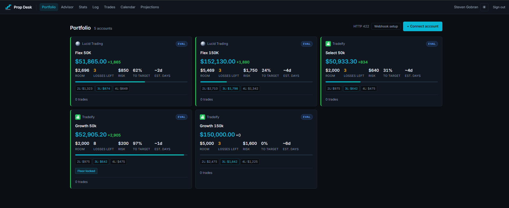
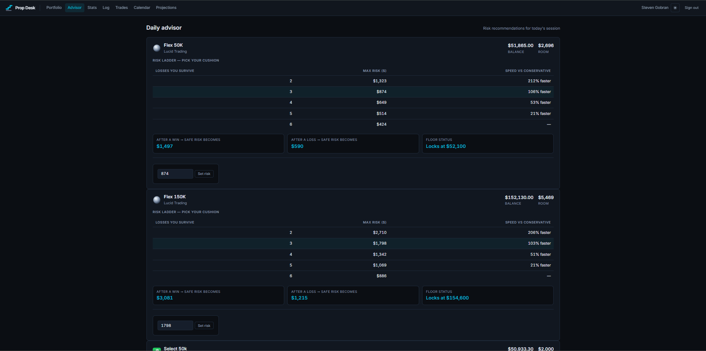
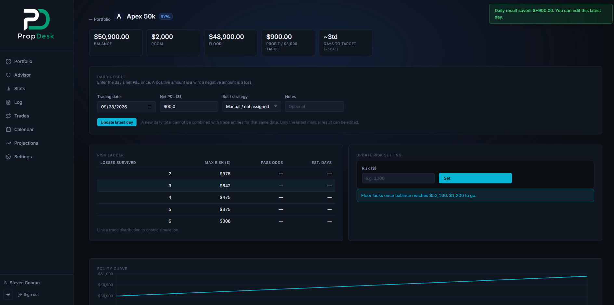
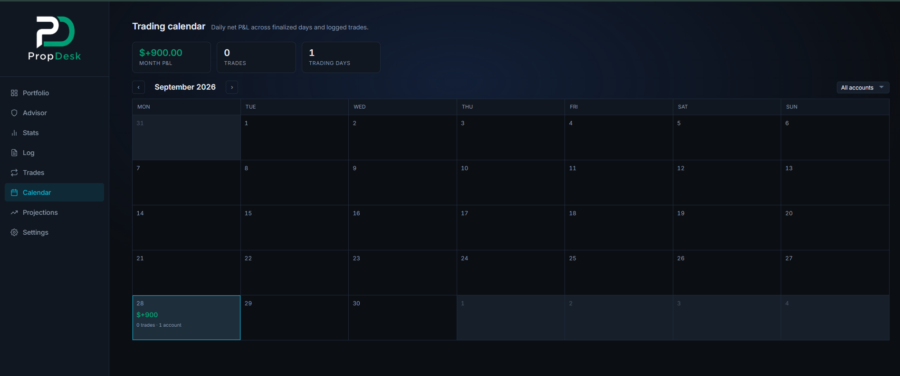
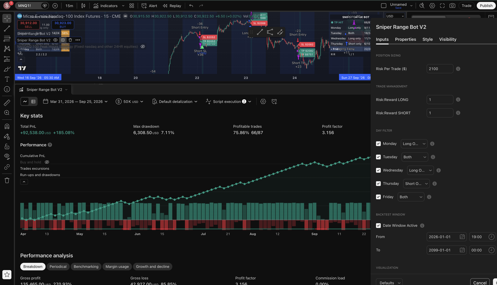

# Prop Desk

A private portfolio dashboard for tracking prop firm futures accounts across Lucid Trading and Tradeify. Answers the two questions that matter every session: **how many losses can this account take right now**, and **how long until it passes**.

**Live demo:** [prop-desk-nb7p.onrender.com](https://prop-desk-nb7p.onrender.com/)

---

## The strategy

All accounts run the **Sniper Range Bot V2** — an automated MNQ futures algorithm built in TradingView Pine Script. Signals fire on a 15-minute chart; orders are routed through TradersPost to live prop firm accounts with no manual intervention.

Key stats from the backtest:
- **~75% win rate** on MNQ 15m
- Consistent across multiple market conditions
- Average win-to-loss ratio keeps expectancy positive even at reduced position sizes
- Signals fire on roughly 68% of trading days

Prop Desk tracks every live fill against these numbers so you always see how live performance compares to the model.

---

## Screenshots

**Portfolio dashboard**



**Daily advisor — risk ladder per account**



**Stats**



**Trading calendar**



**Strategy backtest results (TradingView)**



---

## What it does

- **Portfolio dashboard** — one card per account showing balance, room above the floor, losses survivable at current risk, progress to profit target, and estimated days to pass
- **Risk ladder** — shows max safe risk at 2, 3, 4, 5, and 6 survivable losses so you can pick your cushion without guessing
- **Daily advisor** — per-account recommendations for today's session, including what risk becomes after a win or loss, and when the floor locks
- **Webhook integration** — one URL receives trades from TradingView or TradersPost for all accounts; routes by account name in the payload
- **Automatic daily email** — sent at 6 AM ET Mon–Fri with a snapshot of every account
- **Trades page** — TradingView-style trade list with entry/exit rows, P&L, and direction badges
- **Stats** — per-account win rate, win rate by weekday with sample sizes, slippage tracker
- **Calendar** — monthly P&L view with per-account filter
- **Projections** — funded-phase payout simulation and withdrawal discipline curve
- **Activity log** — append-only audit trail of every trade, setting change, and payout
- **Dark / light mode** — toggle in the nav, persisted across sessions
- **3-dot card menu** — edit or delete accounts directly from the portfolio view

---

## Stack

| Layer | Choice |
|---|---|
| Backend | Python 3.11 + Flask 3 |
| ORM + migrations | SQLAlchemy + Alembic |
| Database | PostgreSQL (Render managed) |
| Auth | Flask-Login + Werkzeug |
| Frontend | Jinja2 + vanilla JS + Chart.js |
| Simulation | NumPy (Monte Carlo, 20k+ runs) |
| Scheduler | APScheduler (daily email) |
| Host | Render |

No React, no Tailwind, no component library.

---

## TradingView webhook setup

1. Portfolio page → **Webhook setup** → copy your inbound URL
2. In TradingView: **Alerts → + Alert → Notifications → Webhook URL** → paste the URL
3. Set the **Message** to pure JSON (no text before or after):

```json
{
  "account": "Flex 50K",
  "ticker": "{{ticker}}",
  "action": "{{strategy.order.action}}",
  "sentiment": "{{strategy.market_position}}",
  "price": {{close}},
  "pnl": {{strategy.netprofit}}
}
```

Replace `"Flex 50K"` with your account's exact nickname. One URL handles all your accounts — just change the `"account"` field per alert. The match is case-insensitive.

| Field | Effect |
|---|---|
| `account` | Routes the trade to the right account **(required)** |
| `action` | `buy` or `sell` — sets trade direction |
| `pnl` | Cumulative strategy P&L — balance updates by the delta |
| `balance` | Sets the account balance directly |
| `price` | Records entry/exit price |
| `quantity` | Contract count |

---

## How the math works

**Room** = `current_balance − max_loss_limit`

**Max risk for N survivable losses** = `(room / N) − friction`

`friction` defaults to $25/trade to cover commission and slippage.

**EOD trailing floor** moves up with peak balance until it hits `lock_threshold`, then freezes. The card shows "Floor locked" when this happens because the risk picture changes: once locked, no more losses are taken from additional wins.

**Estimated days to pass** uses `current_risk` as the assumed average daily gain (one trade/day at 1R), so it reflects today's sizing rather than a historical average that may not apply.

---

## Deployment (Render)

1. Create a **PostgreSQL** instance, copy the internal connection string
2. Create a **Web Service** pointed at this repo
   - Build command: `pip install -r requirements.txt && flask db upgrade`
   - Start command: `gunicorn --workers 1 app:app`
3. Set environment variables:

```
DATABASE_URL    internal Render Postgres URL
SECRET_KEY      long random string
FLASK_ENV       production
MAIL_FROM       sender address for daily reports
MAIL_TO         recipient address
MAIL_HOST       SMTP hostname
MAIL_PORT       587
MAIL_USER       SMTP username
MAIL_PASS       SMTP password
```

4. Run `flask seed-users` once from the Render shell to create your login

> **`--workers 1` is required.** APScheduler runs in-process; multiple workers fire the daily email multiple times.
>
> **SQLite will not work.** Render's filesystem resets on every deploy. Postgres is not optional.

---

## Running locally

```bash
python -m venv venv && source venv/bin/activate
pip install -r requirements.txt
cp .env.example .env   # set DATABASE_URL and SECRET_KEY
flask db upgrade
flask run
```

---

## Security

- Passwords hashed with Werkzeug — never stored in plain text, never committed
- Session cookies: `Secure`, `HttpOnly`, `SameSite=Lax`
- Login route is rate-limited
- No self-registration — users are created via management command
- `.env` is in `.gitignore`

---

This is a record-keeping and decision-support tool. It does not place orders and is not financial advice.
