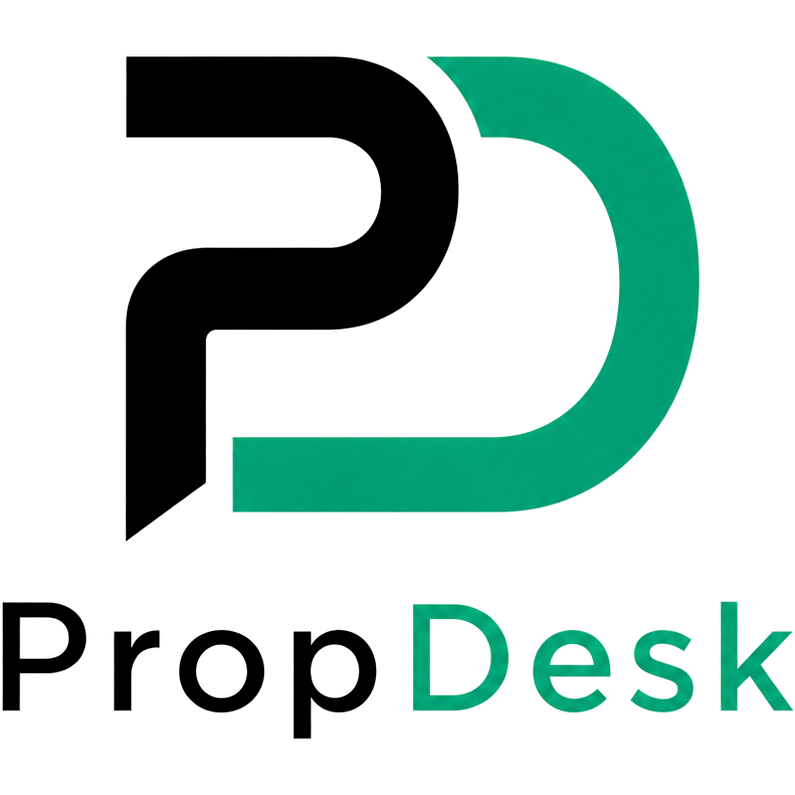
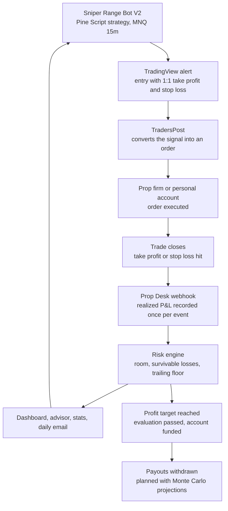

<div align="center">

<picture>
  <source media="(prefers-color-scheme: dark)" srcset="static/brand/logoPD-dark.png">
  
</picture>

**A risk-management dashboard for prop firm futures accounts, fed live by my own automated trading bot.**

It answers the two questions that matter every session:
*how many losses can this account take right now*, and *how long until it passes*.

[](https://prop-desk-nb7p.onrender.com/)
&nbsp;


</div>

<br>


---

## The strategy: Sniper Range Bot V2

I built **Sniper Range Bot V2**, an automated MNQ (Micro Nasdaq-100) futures strategy written in TradingView Pine Script, and I trade it with real money on **funded prop firm accounts and my personal account**. Signals fire on a 15-minute chart. TradersPost routes the orders to the broker, so no one has to click anything. Prop Desk records every fill and checks live results against the backtest.

<div align="center">

| Win rate | Trades | Profit factor | Net P&L (50K acct) | Max drawdown |
|:---:|:---:|:---:|:---:|:---:|
| **75.86%** | 66 / 87 | **3.16** | **+$92,538** (+185%) | 7.11% |

<sub>TradingView backtest, MNQ 15m, Mar 31 – Sep 25, 2026. Past performance does not guarantee future results.</sub>

</div>


- A per-weekday direction filter (long only, short only, or both) based on each day's historical edge
- Fixed 1:1 risk-to-reward, with position size set from risk per trade
- Built to stay inside prop firm drawdown and consistency rules

---

## How it all works



1. **Build:** the strategy is written and backtested in TradingView until its edge holds up across market conditions.
2. **Execute:** when a setup forms, a TradingView alert sends the signal (with take profit and stop loss) to TradersPost, which places the order on the prop firm or personal account.
3. **Track:** every closed trade posts its realized P&L to Prop Desk's webhook. Prop Desk updates the balance, the trailing drawdown floor, and how many more losses the account can survive.
4. **Take profit:** when an evaluation reaches its target the account becomes funded, and the projections page plans payouts. The advisor sets the next session's risk, and the cycle repeats.

---

## Features

<table>
<tr>
<td width="50%" valign="top">

**Portfolio dashboard**<br>
One card per account with balance, room above the floor, losses the account can survive at current risk, progress to the profit target, and estimated days to pass.

**Risk ladder**<br>
The largest safe risk per trade if you want to survive 2, 3, 4, 5, or 6 losses, so you can choose a cushion without guessing.

**Daily advisor**<br>
Recommendations for each account's session: what risk becomes after a win or a loss, and when the floor locks.

**Webhook integration**<br>
One URL takes trades from TradingView or TradersPost for every account and routes each one by the account name in the payload. Retried deliveries are ignored.

</td>
<td width="50%" valign="top">

**Stats**<br>
Win rate for each account, win rate by weekday with sample sizes, and slippage tracking.

**Calendar**<br>
Monthly P&L view with a per-account filter.

**Projections**<br>
Monte Carlo simulation of funded-phase payouts (20k+ runs) and a withdrawal discipline curve.

**Daily email · Activity log · Dark/light mode**<br>
A snapshot of every account emailed at 6 AM ET, an append-only audit trail of trades, setting changes, and payouts, and a theme setting that is saved between sessions.

</td>
</tr>
</table>

---

## Screenshots

<table>
<tr>
<td width="50%"><b>Daily advisor</b>: risk ladder per account<br></td>
<td width="50%"><b>Stats</b>: win rate by weekday and slippage<br></td>
</tr>
<tr>
<td colspan="2"><b>Trading calendar</b>: monthly P&L<br></td>
</tr>
</table>

---

## Stack

| Layer | Choice |
|---|---|
| Backend | Python 3.11 + Flask 3 |
| ORM + migrations | SQLAlchemy + Alembic |
| Database | PostgreSQL (Render managed) |
| Auth | Flask-Login + Werkzeug |
| Frontend | Jinja2 + vanilla JS + Chart.js |
| Simulation | NumPy (Monte Carlo, 20k+ runs) |
| Scheduler | APScheduler (daily email) |
| Trading | TradingView Pine Script → TradersPost |
| Host | Render |

No React, no Tailwind, no component library.

### Project structure

```
Prop-Desk/
├── app.py              # app factory, security headers, scheduler
├── config.py           # environment-based settings
├── models.py           # SQLAlchemy models (users, accounts, trades, webhooks)
├── cli.py              # flask commands (seed users, etc.)
├── engine/             # pure-Python math: risk, accounting, funded phase, Monte Carlo
├── routes/             # Flask blueprints, one per page, plus api.py (webhooks + daily email)
├── templates/          # Jinja2 pages
├── static/             # CSS, JS, brand assets, prop firm logos
├── migrations/         # Alembic database migrations
├── tests/              # pytest suite
└── docs/               # screenshots, backtest export, source artwork
```

---

## How the math works

**Room** = `current_balance − max_loss_limit`

**Max risk for N survivable losses** = `(room / N) − friction`

`friction` defaults to $25 per trade to cover commission and slippage.

**EOD trailing floor**: the floor rises with peak balance until it reaches `lock_threshold`, then stays fixed. Once that happens the card shows "Floor locked", because further wins no longer raise the floor, which changes how much you can safely risk.

**Estimated days to pass** assumes an average daily gain equal to `current_risk` (one trade a day at 1R). That way it follows today's sizing instead of a historical average that may no longer apply.

---

<details>
<summary><h2>TradingView webhook setup</h2></summary>

1. Portfolio page → **Webhook setup** → copy your inbound URL
2. In TradingView: **Alerts → + Alert → Notifications → Webhook URL** → paste the URL
3. Set the **Message** to pure JSON (no text before or after):

```json
{
  "event_id": "{{timenow}}-{{strategy.order.id}}",
  "account": "Flex 50K",
  "ticker": "{{ticker}}",
  "action": "{{strategy.order.action}}",
  "sentiment": "{{strategy.market_position}}",
  "price": {{strategy.order.price}}
}
```

Replace `"Flex 50K"` with your account's exact nickname. One URL handles all your accounts; just change the `"account"` field for each alert. The match is not case-sensitive. This sample only logs signals and does not change the account balance.

| Field | Effect |
|---|---|
| `account` | Routes the trade to the right account **(required)** |
| `event_id` | Unique event identifier. Required when sending P&L; stops a retried delivery from being counted twice |
| `action` | `buy` or `sell`; sets trade direction |
| `pnl` | Realized P&L for exactly one completed trade. Never send a cumulative strategy total |
| `balance` | Sets the account balance directly |
| `price` | Records entry/exit price |
| `quantity` | Contract count |

To update the balance from fills, send realized P&L once when a trade closes and include its stable `event_id` (or `execution_id`, `fill_id`, or `trade_id`). Set `pnl_mode` explicitly to `realized` (or `delta`). The `pnl` value is treated as the amount for that one event and added to the balance. Requests without a mode are rejected, and so are cumulative values such as TradingView's `strategy.netprofit`. After webhook trades arrive, use **Close trading day** on the account page to finalize daily results and apply EOD drawdown rules.

If a TradersPost forward URL is configured, signal-only events may trigger live orders. Fill and balance-update events are never forwarded. Failed forwards appear in the Activity log, and an event ID that was already used will not be forwarded again, so check that TradersPost accepted the order before you send a new event ID.

</details>

<details>
<summary><h2>Deployment (Render)</h2></summary>

1. Create a **PostgreSQL** instance and copy the internal connection string
2. Create a **Web Service** pointed at this repo
   - Build command: `pip install -r requirements.txt && flask db upgrade`
   - Start command: `gunicorn --workers 1 app:app`
3. Set environment variables:

```
DATABASE_URL        internal Render Postgres URL
SECRET_KEY          long random string (required; the app will not start without it)
FLASK_ENV           production
REPORT_EMAIL        Gmail address the daily report is sent from and to
GMAIL_APP_PASSWORD  Gmail app password for that address
```

4. Run `flask seed-users` once from the Render shell to create your login

To create one user without the Render Shell, add `BOOTSTRAP_USER_ENABLED=true`,
`BOOTSTRAP_USER_USERNAME`, `BOOTSTRAP_USER_DISPLAY_NAME`, `BOOTSTRAP_USER_EMAIL`,
and `BOOTSTRAP_USER_PASSWORD` to the service's Environment settings, then deploy.
On startup the app creates the user only if the username and email are not already taken, and
the user must change the password at first login. Once the deployment reports that the user was
created, remove the bootstrap variables. Do not commit real passwords.

> **`--workers 1` is required.** APScheduler runs inside the web process, so with multiple workers the daily email is sent once per worker.
>
> **SQLite will not work.** Render's filesystem resets on every deploy, so you need Postgres.

</details>

<details>
<summary><h2>Running locally</h2></summary>

```bash
python -m venv venv && source venv/bin/activate
pip install -r requirements.txt
cp .env.example .env   # set DATABASE_URL and SECRET_KEY
flask db upgrade
flask run
```

</details>

---

## Security

- Passwords are hashed with Werkzeug. They are never stored in plain text or committed
- Session cookies are `Secure`, `HttpOnly`, and `SameSite=Lax`
- The login route is rate-limited
- No self-registration: users are created with a management command
- `.env` is listed in `.gitignore`

---

<div align="center">

**Built by [Steven Gobran](https://github.com/stevenGGG23)**

<sub>Prop Desk keeps records and helps with trading decisions. It does not place orders itself (the bot does that through TradersPost), and nothing here is financial advice.</sub>

</div>
